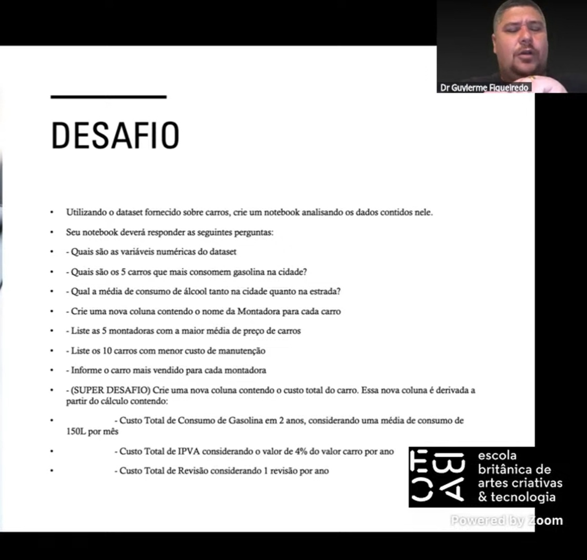

# Análise de Dados de Veículos - Desafio EBAC

Este repositório contém a solução para o desafio proposto no workshop "Analistas de Dados: Como vivem? Onde comem? O que fazem?" da EBAC (Escola Britânica de Artes Criativas & Tecnologia). O projeto consiste em uma análise exploratória de um dataset sobre carros, utilizando Python e a biblioteca Pandas em um Jupyter Notebook.

## 📄 O Desafio

O objetivo era utilizar o dataset fornecido para responder a uma série de perguntas de negócio e, ao final, resolver um "Super Desafio" envolvendo o cálculo do custo total de propriedade de um veículo ao longo de dois anos.

As perguntas a serem respondidas foram:
1.  Quais são as variáveis numéricas do dataset?
2.  Quais são os 5 carros que mais consomem gasolina na cidade?
3.  Qual a média de consumo de álcool tanto na cidade quanto na estrada?
4.  Criar uma nova coluna contendo o nome da Montadora para cada carro.
5.  Listar as 5 montadoras com a maior média de preço de carros.
6.  Listar os 10 carros com menor custo de manutenção.
7.  Informar o carro mais vendido para cada montadora.
8.  **(SUPER DESAFIO)** Criar uma nova coluna contendo o custo total do carro em 2 anos, considerando:
    * Preço inicial do veículo.
    * Custo total de consumo de gasolina (média de 150L/mês).
    * Custo total de IPVA (4% do valor do carro por ano).
    * Custo total de revisão (1 revisão por ano).

## 🛠️ Ferramentas Utilizadas

* **Linguagem:** Python
* **Biblioteca:** Pandas
* **Ambiente:** Jupyter Notebook (via Google Colab)

## 🔍 Análise e Resultados

A análise foi estruturada para responder a cada uma das perguntas do desafio. Abaixo estão os principais resultados encontrados:

### 1. Variáveis Numéricas
O dataset possui 8 variáveis numéricas: `Unnamed: 0`, `preco`, `unidades_vendidas`, `cidade_alcool`, `cidade_gasolina`, `estrada_alcool`, `estrada_gasolina` e `custo_revisao`.

### 2. Top 5 Carros com Maior Consumo de Gasolina (Menor km/l)
| Modelo | Consumo (km/l) |
| :--- | :--- |
| Volkswagen T-Cross | 10.0 |
| Hyundai Creta | 10.1 |
| Renault Duster | 10.5 |
| Fiat Fiorino | 10.7 |
| Renault Oroch | 11.1 |

### 3. Média de Consumo de Álcool
* **Na Cidade:** 8.73 km/l
* **Na Estrada:** 9.90 km/l

### 4. Montadoras com Maior Média de Preço
1.  **Nissan:** R$ 114.998,50
2.  **Chevrolet:** R$ 101.001,00
3.  **Peugeot:** R$ 100.165,00
4.  **Volkswagen:** R$ 98.111,67
5.  **Toyota:** R$ 96.208,00

### 5. Top 10 Carros com Menor Custo de Manutenção
| Modelo | Custo Revisão (R$) |
| :--- | :--- |
| Hyundai HB20 | 2.946,10 |
| Hyundai HB20S | 2.946,10 |
| Nissan Kicks | 3.006,00 |
| Renault Kwid | 3.162,95 |
| ... | ... |

### 6. Carro Mais Vendido por Montadora
| Montadora | Modelo | Unidades Vendidas |
| :--- | :--- | :--- |
| Volkswagen | Volkswagen Polo | 16.471 |
| Hyundai | Hyundai HB20 | 12.126 |
| Fiat | Fiat Strada | 10.387 |
| Chevrolet | Chevrolet Onix | 10.260 |
| ... | ... | ... |

### 7. Custo Total de Propriedade em 2 Anos (Super Desafio)
Considerando o preço de compra e os custos de gasolina, IPVA e revisões, o **Fiat Mobi** se destacou como o carro com o menor custo total após 2 anos, totalizando **R$ 96.877,24**.

## 🚀 Como Executar o Projeto

1.  Clone este repositório.
2.  Certifique-se de ter o Python e o Jupyter Notebook instalados.
3.  Instale a biblioteca Pandas (`pip install pandas openpyxl`).
4.  Abra o arquivo `desafio_ebac.ipynb` no Jupyter Notebook e execute as células.
